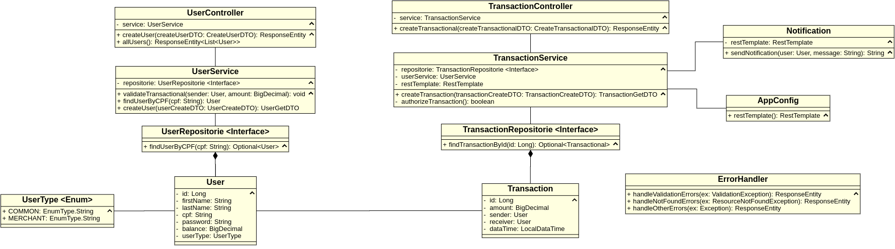

# Desafio - PicPay Simplificado

**Link do desafio:** [PicPay Desafio Backend](https://github.com/PicPay/picpay-desafio-backend)

> Este projeto é uma solução para o desafio proposto pelo PicPay para desenvolvimento de uma aplicação que simplifica transferências de dinheiro entre usuários comuns e lojistas. Porém, esta solução não será enviada para avaliação. Caso fosse, não poderia mencionar o nome do banco, pois está nas regras do desafio (link acima).

---

## Requisitos:

- Dois tipos de usuários: Lojista e Comum, ambos com carteira de dinheiro para realizar transferências.
- Para ambos os tipos de usuários, são necessários nome completo, CPF, email e senha.
- CPF e email devem ser únicos no sistema.
- Usuários podem transferir dinheiro para lojistas e outros usuários comuns.
- Lojistas apenas recebem transferências, não enviam dinheiro.
- Validação do saldo do usuário antes da transferência.
- Consulta a um serviço autorizador externo antes de realizar transferência.
- As transferências devem ser transações reversíveis em caso de inconsistência.
- Envio de notificação por um serviço de terceiro, mesmo que esteja indisponível, durante o recebimento de transferência.

---

## Boas práticas:

- Documentação.
- Código limpo e organizado.
- Conhecimento de padrões.
- Consistência e capacidade de argumentação das escolhas.
- Modelagem de dados.
- Manutenibilidade do código.
- Tratamento de erros.
- Desacoplamento de componentes.
- A avaliação será focada apenas na API Restful, excluindo o frontend, se houver.
- Não é necessário implementar autenticação.

---

## Tecnologias Utilizadas (por João Pedro):

- **Java 21:** Linguagem de programação amplamente utilizada.
- **Maven:** Gerenciador de dependências para projetos Java.
- **Spring Web:** Facilita o desenvolvimento de APIs Restful.
- **Spring Data JPA:** Facilita a persistência dos dados.
- **Lombok:** Ajuda na geração de código.
- **DevTools:** Funcionalidades como reload automático.
- **H2:** Banco de dados em memória para simplificar o desenvolvimento, sem a necessidade de migrations.

---

## Modelagem

